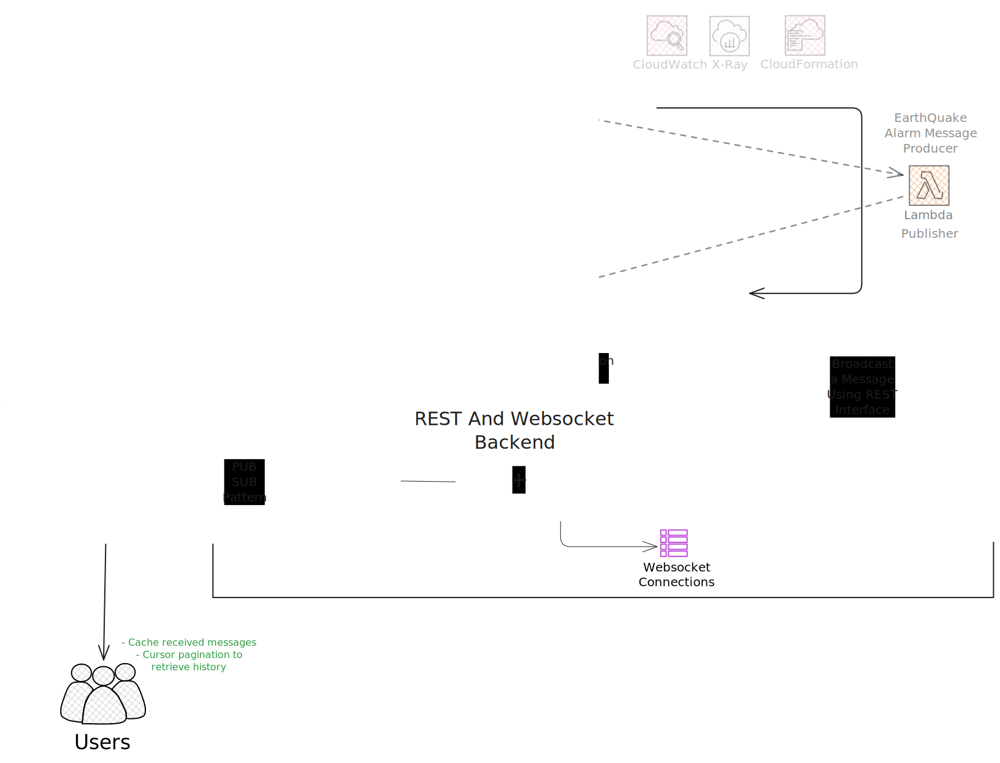

# Technical Decision Summary

## Architecture Overview

### Accepted Stack

## Core Philosophy

### Problem-First Evaluation

We evaluate technologies based on **actual constraints**, not theoretical capabilities. Many messaging systems excel at
high throughput, complex routing, or replay capabilities—features we don't require for an **MINIMUM VIABLE PRODUCT -
EVENT DRIVEN** chat
service.

**Note**: Distinguish between what we actually need versus what technologies are optimized for.

### Operational Simplicity

Prioritize **Platform-as-a-Service (PaaS)** solutions over Infrastructure-as-a-Service (IaaS) to minimize operational
overhead. We accept trade-offs that enable faster development, knowing we can refactor later.

- Reliable, asynchronous message delivery
- Minimal operational overhead (no broker management)
- Predictable costs aligned with MVP scale
- Support for local development workflows
- AWS-native architecture for consistency

---

### Why This Stack?

| Decision Document                                        | Status   | Key Technology           | Summary                                                           |
|----------------------------------------------------------|----------|--------------------------|-------------------------------------------------------------------|
| [`aws-cloud-provider.md`](./aws-cloud-provider.md)       | Accepted | **AWS**                  | LocalStack compatibility, mature serverless ecosystem             |
| [`why-dynamodb.md`](./why-dynamodb.md)                   | Accepted | **DynamoDB + Streams**   | Atomic writes eliminate dual-write risks                          |
| [`why-apigateway.md`](./why-apigateway.md)               | Accepted | **API Gateway**          | WebSocket + REST, Cognito integration, built-in throttling        |
| [`why-streamlit.md`](./why-streamlit.md)                 | Accepted | **Streamlit**            | Fastest path to working UI, minimal code                          |
| [`why-data-access-layer.md`](./why-data-access-layer.md) | Accepted | **DAL Pattern**          | Provides database independence to support potential migrations    |
| [`apigw-v1-localstack.md`](./apigw-v1-localstack.md)     | Accepted | **API Gateway Strategy** | V2 for production, V1 compatibility + local server for LocalStack |

---

## Rejected Alternatives

Document Reference

| Decision Document                              | Status   | Key Technology | Summary                                                    |
|------------------------------------------------|----------|----------------|------------------------------------------------------------|
| [`why-not-kafka.md`](./why-not-kafka.md)       | Rejected | Apache Kafka   | Overkill for MVP; optimized for scale we don't need        |
| [`why-not-rabbitmq.md`](./why-not-rabbitmq.md) | Rejected | RabbitMQ       | Operational complexity outweighs routing benefits          |
| [`why-not-redis.md`](./why-not-redis.md)       | Rejected | Redis          | Durability risks, memory-first design conflicts with needs |
| [`why-not-sns-sqs.md`](./why-not-sns-sqs.md)   | Rejected | SNS + SQS      | Dual-write complexity vs. DynamoDB Streams atomicity       |

---

## Migration Paths

The architecture is designed to be **refactorable**. We can migrate components as requirements evolve:

| Component            | Current Limitation              | Future Migration Path                                       |
|----------------------|---------------------------------|-------------------------------------------------------------|
| **DynamoDB Streams** | 24-hour replay, limited fan-out | → SNS+SQS if needed                                         |
| **Streamlit**        | Less UI flexibility             | → React/Angular if needed                                   |
| **DAL Pattern**      | Additional abstraction overhead | → Remove if committing to single DB, or extend for multi-DB |
| **Kafka/RabbitMQ**   | Not needed at MVP scale         | → Choose when organizational scale requires it              |

**Key Principle**: Avoid premature optimization. Accept limitations that enable faster development, refactor when
requirements justify it.

---

## Key Takeaways

1. **Atomicity matters**: DynamoDB Streams eliminates dual-write problems
2. **Simplicity over scale**: Choose solutions for actual needs, not theoretical capabilities
3. **Operational burden is real**: Managed services reduce failure modes
4. **MVP velocity**: Accept trade-offs that enable faster development
5. **Refactorable architecture**: Design for migration when requirements evolve
